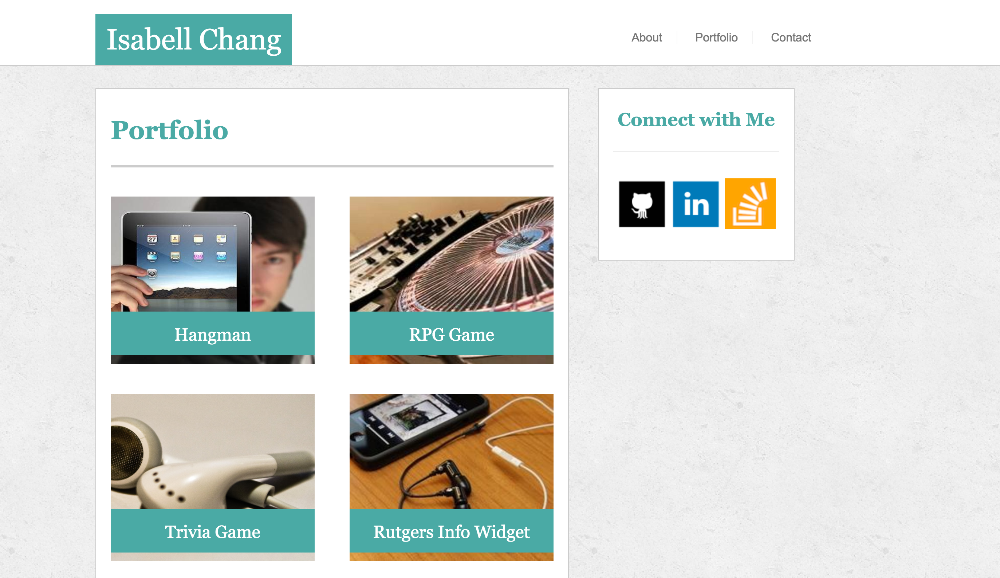

# Portfolio1

[Practice Portfolio with Media Queries](https://desolate-chamber-96957.herokuapp.com/)

##In this assignment, media queries were added to a standard portfolio page using just HTML and CSS.
Media queries for 3 different widths (980px, 768px, and 640px) were added using @media screen CSS tags. The max-widths along with the properties for the desired layouts were added to the CSS to display the site as it should look. This demonstration was done to emphasize the importance of responsive design on a webpage due to the varying sizes of device screens that users can view from.

###Below are images of each page of the practice portfolio.

*This is the About page.

*This is the Portfolio page.

*This is the Contact page.

